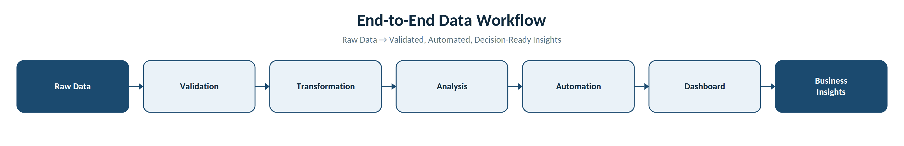

# Hi, I'm Peter Ahenda 👋

**Data Analytics & Automation**

I build end-to-end analytics solutions that transform raw data into clean datasets, automated reporting pipelines and interactive dashboards using **Python, SQL, Power BI and Excel**.

---

## 📌 What I Do

I'm currently expanding my portfolio while helping businesses reduce manual reporting and improve data-driven decision making.

---

## 🛠 Tech Stack

- Python (Pandas, NumPy, Matplotlib)
- SQL (PostgreSQL)
- Power BI
- Excel & Power Query
- Git & GitHub

---

## 💼 Services

✔ Data Cleaning & Validation

✔ SQL Reporting & Business Intelligence

✔ Reporting Automation

✔ Dashboard Development

✔ Data Visualisation

---

## 🚀 Featured Projects

| Project | Description | Tech |
|----------|-------------|------|
| Project 1 | ... | ... |
| Project 2 | ... | ... |
| Project 3 | ... | ... |

---

## 🔄 Analytics Workflow

---

## ⚙️ How I Work

Every project is designed to be:

- ✔ Well documented
- ✔ Reproducible
- ✔ Version controlled
- ✔ Easy to maintain
- ✔ Business focused

---

## 👨‍💻 About Me

I'm a mathematics graduate with professional experience delivering analytical solutions and improving reporting processes. I enjoy transforming messy data into reliable, well-documented workflows that automate manual tasks, improve data quality and support better business decisions.

---

## 📈 Currently Learning

- Advanced Python Automation
- Power BI
- Forecasting
- Data Engineering concepts

---

## 🤝 Let's Connect

- [LinkedIn](https://www.linkedin.com/in/peter-ahenda-bengo-371010a4/)
- pahendab@gmail.com
- Upwork *(coming soon)*
- Fiverr *(coming soon)*
